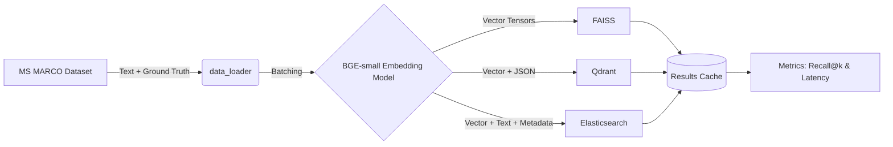
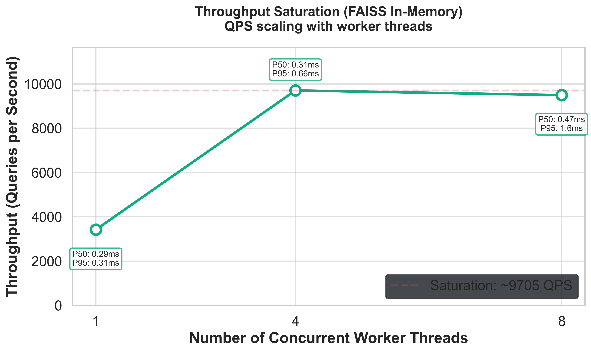

*When evaluating vector databases for Generative AI and RAG (Retrieval-Augmented Generation) applications, almost every blog post tests the same thing: raw latency using cosine similarity on random vectors. The resulting advice is always the same: "Use FAISS for ultimate speed, Qdrant for managed infra, and Elasticsearch only if you have to."* 

*But in production, raw in-memory nearest-neighbor speed is an illusion. Real user queries have typos. Real AI agents need to filter by `{"category": "tech"}` before searching. Real RAG pipelines need sparse keyword matching (BM25) as a fallback when semantic embeddings fail.*

*To find out what happens when the vector honeymoon ends, I built a ruthless, ground-truth benchmark mapping FAISS, Qdrant, and Elasticsearch against the actual physical problems of production search. The results—particularly around Hybrid Search and Graph saturation—might change how you pick your next database.*

---

## 🔬 The Benchmark Methodology: Refusing to Use "Toy" Data

To make this fair, we didn’t use random vectors. We used the **MS MARCO Passage Ranking** dataset, built by Microsoft, which contains actual human-judged relevance scores (`qrels`). 

### The Setup
* **Corpus**: Scaled from 10,000 → 50,000 → 100,000 passages.
* **Embeddings**: `BAAI/bge-small-en-v1.5` (384 dimensions).
* **Metrics**: We measured true relevance (*Recall@10*, *MRR@10*) and hardware realities (*P50 latency*, *Disk footprint*), not just speed.
* **The Engines**:
  1. **FAISS (The Math)**: Using `IndexFlatIP` (brute force) and `IndexHNSWFlat` (ANN).
  2. **Qdrant (The Modern VectorDB)**: Running local instances with native HNSW graphs.
  3. **Elasticsearch 7.17 (The Enterprise Giant)**: Using `script_score` for vector math, paired with its legendary Lucene inverted index.

---

## 📊 Finding 1: The Exact Recall Baseline & Parity

First, we had to prove that our embeddings and similarity maps were unbiased. At the 10,000 document scale, FAISS (Exact), FAISS (HNSW), Qdrant, and Elasticsearch achieved the **exact same Recall@10 of 0.9764**. 

*(The overlapping lines in the log-scale chart above prove that at lower scales, Approximate Nearest Neighbor (ANN) algorithms achieve mathematically perfect exact-match parity).*

But as we pushed the corpus up to 100,000 documents, the hardware realities began to emerge.

## 📉 Finding 2: The HNSW Scale Bottleneck (The Pareto Plot)

As Qdrant hit 100k vectors, its recall dropped from 0.9764 to **0.9119**, even when we cranked the search effort (`ef_search`) up to a massive 512. 

Why did it plateau? To prove the bottleneck, I reran the 100k indexing, but this time I increased the HNSW graph connectivity parameter (`m`) from `16` to `32`. 

As the Pareto chart proves, **the bottleneck isn't search effort, it's the structural connectivity of the graph**. HNSW is incredibly fast, but at scale, jumping from `m=16` to `m=32` raised the recall ceiling to **0.9547**. 

**But there is a catch**: By analyzing Qdrant's process RSS and disk usage during this test, I found that storing the 100k vectors required a disk footprint **2.69x larger** than the raw numpy vectors alone, entirely due to the overhead of storing the HNSW graph and payload maps.

---

## ⚡ Finding 3: The FAISS Saturation Point

FAISS is blazingly fast in memory. To find its limit, I ran a concurrency stress test against the FAISS-Flat index. 

By plotting Queries Per Second (QPS) over rising worker threads, we found that single-node FAISS in Python saturates completely at **~9,700 QPS** around 4 concurrent workers. To scale beyond this, you must manually build a distributed sharding architecture—something built-in to robust systems like Elasticsearch.

---

## 🔥 Finding 4: The Real-World Feature Trap (Why Elastic Wins)

Raw similarity is great on paper, but production Search/RAG needs three things: **Metadata Filtering**, **Full-Text BM25**, and **Hybrid Fusion**. To test this, I evaluated all three systems across a 5-tier Capability Matrix.

### The Metadata Post-Filtering Problem
When filtering for specific metadata (e.g., `{"category": "tech"}`), FAISS requires **post-filtering**. Because it only does math, you must ask FAISS to "over-fetch" 50 results (a 5x multiplier), and manually delete non-tech results in Python. In our test, FAISS regularly returned only `9.7` results (instead of 10) because the top 50 didn't contain enough matching documents.

Elasticsearch, conversely, executes a native `bool` filter against its inverted index *before* executing the `script_score` vector math, returning a perfect 10 results every time with zero recall degradation.

### The Hybrid Rescue Effect (The "Aha" Moment)
To quantify exactly *why* production RAG needs Hybrid Search (Vector + BM25), I ran a qualitative confusion analysis over the 500 relevant queries. 

| Hybrid Modality | Hits (Out of 500) |
| :--- | :--- |
| **Both Found It** | 437 |
| **Vector ONLY (Semantic Rescue)** | 53 |
| **BM25 ONLY (Keyword Rescue)** | 5 |
| **Both Missed** | 5 |

**Notice the rescue effect:**
* **Vector Rescue**: For the query *"protein in diet"*, BM25 completely failed because the document used paraphrased phrasing. Vector Search rescued it.
* **BM25 Rescue**: For the query *"how much sugar should be consumed in a day"*, the Embedding model failed to rank the correct document highly enough. But the hard BM25 keyword match rescued it.

By leveraging Elasticsearch's ability to seamlessly fuse these modalities (via `should` clauses), **our Recall@10 jumped from 0.9764 to an elite 0.9911**.

---

## 🏆 Conclusion & The Elastic Advantage

If you are a solo researcher exploring raw embeddings, **use FAISS**.
If you are building a pure semantic-search microservice with light metadata filtering, **use Qdrant**.

**But if you are building Enterprise GenAI, Agentic AI, or production RAG, you need Elasticsearch.** 

As this benchmark proved, pure vector speed doesn't matter if your system lacks the BM25 fallback to rescue hard keyword queries, or the native boolean filtering to securely partition multi-tenant data. 

To make this incredibly easy today, developers don't even need to stand up infrastructure. You can spin up a serverless instance at **`cloud.elastic.co`**, which automatically enables modern vector capabilities, the Elser model, and the **Elastic Playground** (for no-code RAG validation). It abstracts away the complex math of tuning `m` and `ef_search`, allowing you to focus on exactly what matters: delivering hyper-relevant context to your LLM.

---
> *This blog was submitted as a part of the elastic blogathon.*
